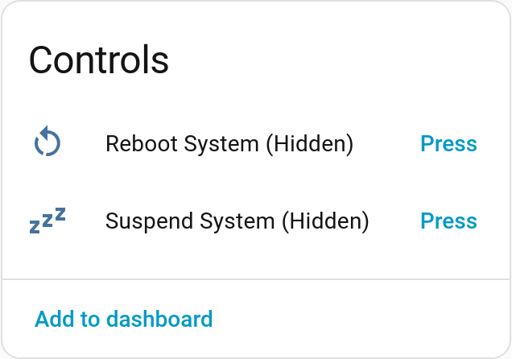
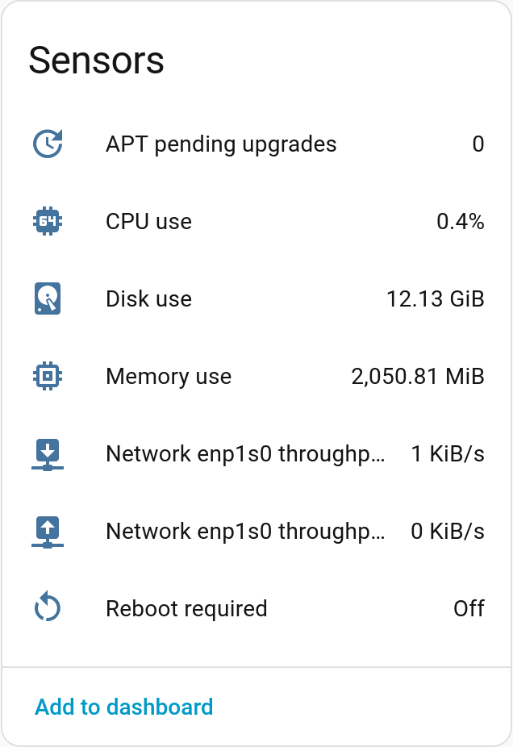
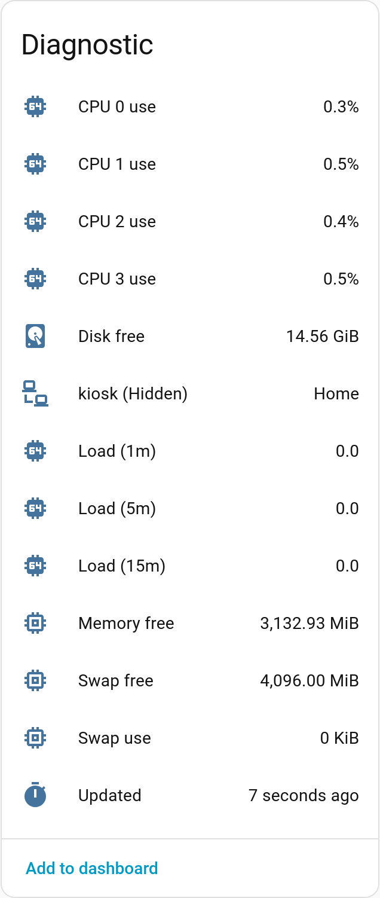

# ubuntu-mqtt2ha-reporter

A service to report system status of Ubuntu operating system to Home Assistant via MQTT.

## Features

It provides the following to Home Assistant:

<table>
<tr>
<td>



</td>
<td>

Include buttons to
- Reboot system
- Suspend system

You may want to hide them from the Overview
so that you don't click them accidentally.

</td>
</tr>
<tr>
<td>



</td>
<td>

Include sensors of:
- Overall CPU usage
- Used memory
- Used disk space
- Per-interface network throughput in / out
- Pending APT upgrades
- Pending system reboot

Pending APT upgrades sensor also reports pending packages in its attribute.

Similarly, pending reboot sensor also reports packages
requiring reboot in its attribute.

</td>
</tr>
<tr>
<td>



</td>
<td>

Include diagnostic sensors of:
- Per-CPU usage
- Free memory
- Free and used swap
- Free disk
- Load (1m, 5m, 15m)
- Last update time of sensors

As the daemon also reports MAC addresses,
it can be used with device tracker to show availability.

</td>
</tr>
</table>

The daemon publishes discovery messages,
so that it can be automatically discovered by Home Assistant with MQTT integration enabled.

All sensors and controls become unavailable when the daemon is stopped,
or the system is suspended.

## Installation

### Using Debian Package

Download the latest deb package from [GitHub releases](https://github.com/upsuper/ubuntu-mqtt2ha-reporter/releases),
and install it using `dpkg`:

```sh
dpkg -i ubuntu-mqtt2ha-reporter_0.1.10-1_all.deb
```

Then fill in configuration at `/etc/ubuntu-mqtt2ha-reporter/config.toml`.
(See [Configuration](#configuration) for details.)

### Using Cargo

```bash
cargo install ubuntu-mqtt2ha-reporter

# Create a system user `ubuntu-mqtt2ha-reporter` with group of the same name.
useradd --system \
    --user-group \
    --no-create-home \
    --shell /bin/false \
    ubuntu-mqtt2ha-reporter

# Create a directory `/etc/ubuntu-mqtt2ha-reporter/`.
mkdir -p /etc/ubuntu-mqtt2ha-reporter
chown root:ubuntu-mqtt2ha-reporter /etc/ubuntu-mqtt2ha-reporter
chmod 750 /etc/ubuntu-mqtt2ha-reporter
# Create `config.toml` file in it.
touch /etc/ubuntu-mqtt2ha-reporter/config.toml
chmod 640 /etc/ubuntu-mqtt2ha-reporter/config.toml
# Fill in configuration, see details below.

# Copy the binary to `/usr/local/bin/`.
cp ~/.cargo/bin/ubuntu-mqtt2ha-reporter /usr/local/bin/

# Download and copy `ubuntu-mqtt2ha-reporter.service` to `/etc/systemd/system/`.
curl -sSL https://raw.githubusercontent.com/upsuper/ubuntu-mqtt2ha-reporter/main/debian/ubuntu-mqtt2ha-reporter.service \
    -o /etc/systemd/system/ubuntu-mqtt2ha-reporter.service
# Enable the service.
systemctl daemon-reload
systemctl enable ubuntu-mqtt2ha-reporter
systemctl start ubuntu-mqtt2ha-reporter
```

To enable buttons to restart and suspend the system, also
```bash
# Download and copy `20-ubuntu-mqtt2ha-reporter` to `/etc/sudoers.d/`.
curl -sSL https://raw.githubusercontent.com/upsuper/ubuntu-mqtt2ha-reporter/main/debian/20-ubuntu-mqtt2ha-reporter \
    -o /etc/sudoers.d/20-ubuntu-mqtt2ha-reporter
```

## Configuration

The default `/etc/ubuntu-mqtt2ha-reporter/config.toml` installed with the deb package
contains commented configuration. Fill in the configuration as needed.

All options are optional,
but generally the minimal configuration needed is:
```toml
[mqtt]
# Can be omitted if it's `localhost`.
hostname = "mqtt.example.com"
# Can be omitted if the broker doesn't require authentication.
username = "username"
password = "password"
```

If using TLS to connect to the broker,
adding the following to `[mqtt]` section:
```toml
port = 8883
tls = true
# Path to CA certificate file to verify host.
# Can be omitted if the broker is not using a self-signed certificate.
tls_ca_cert = "/path/to/ca.pem"
```

Other options:
- `daemon.interval_in_minutes`: How frequent to report system status to broker.
  The default value is 5 minutes.
- `mqtt.discovery_prefix`:
  The default value is the default discovery prefix of Home Assistant,
  but if you use a different discovery prefix for Home Assistant,
  you can change it here.
- `mqtt.base_topic`: The default value is `home/nodes`,

## License
    
    ubuntu-mqtt2ha-reporter - A daemon to report system status to Home Assistant via MQTT
    Copyright (C) 2024-2025 Xidorn Quan

    This program is free software: you can redistribute it and/or modify
    it under the terms of the GNU Affero General Public License as published by
    the Free Software Foundation, either version 3 of the License, or
    (at your option) any later version.

    This program is distributed in the hope that it will be useful,
    but WITHOUT ANY WARRANTY; without even the implied warranty of
    MERCHANTABILITY or FITNESS FOR A PARTICULAR PURPOSE.  See the
    GNU Affero General Public License for more details.

    You should have received a copy of the GNU Affero General Public License
    along with this program.  If not, see <https://www.gnu.org/licenses/>.
